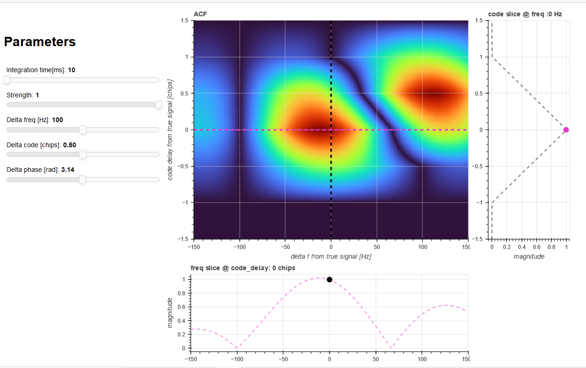
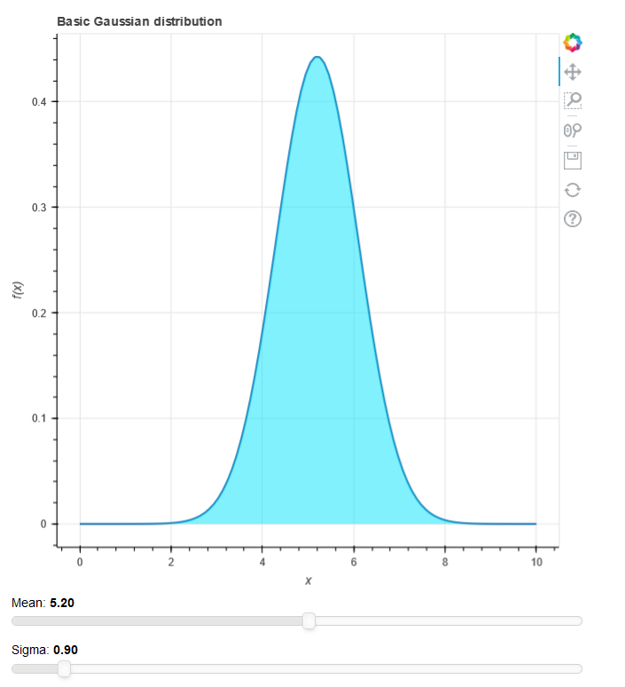

# Interractive visualization experiments

This repo contains a few experiments to visualize and interract with some math equations.

The plots are created with [bokeh](https://bokeh.org/). Bokeh is interesting tool for interractive visualization, as it provides good plotting functionality, screen layouts, as well as widgets to interract with the plots. Bokeh also provides it's own webserver, allowing to use the browser as the renderer. 

These are experiments, that I used to get familiar with the tools. Since my experience with the tools is limited, they should be viewed as examples of *what* can be done, and not *how* to do it. 

These experiments assume a local [Anaconda](https://www.anaconda.com/) installation. 

## The experiments


### File: acf_with_panel.py
An interrative visualization of the ACF. This is currently the most complete example.  

In addition to [bokeh](https://bokeh.org/), it uses [panel](https://panel.holoviz.org/index.html). Panel is mainly used for it's dependency system (`pn.bind`), which allows to state dependencies between each components. Any change in the value of a dependency will trigger refreshing the calculations and plots that are affected by that value change, while keeping as-is the calculations and plots that are not affected by that change.

```python
# --- Bindings ---
reactive_acf = pn.bind( update_acf, tp=tp_slider, mp_alpha=mp_alpha_slider, mp_freq=mp_freq_slider, mp_code=mp_code_slider, mp_phase=mp_phase_slider)

reactive_plot_acf = pn.bind( plot_acf, reactive_acf, crosshair = crosshair.param.position)
```
The above line defines that the ACF plot should be redrawn, whenever the ACF (reactive_acf) data changes, or if the crosshair position changed.



### File: acf_with_panel.ipypnb

An interrative visualization of the ACF, from a `Jupyter notebook`. 

In addition to [bokeh](https://bokeh.org/), it uses [panel](https://panel.holoviz.org/index.html) which provides a really nice integration to VSCode already pretty nice Jupyter notebook functionality. The following 3 lines, will turn any standard python method that generate a plot, into an web browser interractive plot, launched straight from the Jupyter notebook:

```python
kw = dict(tp=widgets.FloatSlider(start=10E-3,end=100E-3,step=10E-3,value=20E-3))
acf_plot = pn.interact(auto_correlation_plot, **kw)
acf_plot.show()
```
The plot has interractive slider, and since we're in REPL mode with the Jupyter notebook, one can also change parameters from the notebook and the changes will be visible on the plot. 

### File: acf.py
An interrative visualization of the ACF. This is an early trial, kept here to show how nice the panel bindings are. It doesn't use panel, instead it uses basic callbacks. Callbacks do get hard to follow when their amount grows, but here it is probably still manageable. Using callbacks doesn't require `panel` knowledge, which can be a little intimidating at start because of the black magic involved.

### File: gaussian.py
An interrative visualization of a Guassian curve. An early trial. Kept quite simple compared to the ACF visualizations. It doesn't use `panel`.


# Installation hints
## Dependencies
Install dependencies with the familiar
```sh
pip install -r requirements.txt
```
## Visual Studio Code
You should have a fairly recent Visual Studio Code installed. It should come with built-in `Jupyter` support.

## Conda on bash
I like to use bash instead of the conda cmd window. conda support to bash can be added by following the instructions at https://discuss.codecademy.com/t/setting-up-conda-in-git-bash/534473. In a nutshell:
Add the following line to your .bashrc or .bash_profile
```sh
    . /E/python/Anaconda/etc/profile.d/conda.sh
```

 